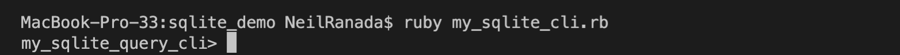

# Welcome to Sqlite Demo
***

## Task
This Sqlite Demo is a command-line application to understand the inner workings of SQL.

## Description
The development of this command-line application is broken down into three overarching parts:
1. Created a custom command-line prompt for accepting and parsing SQL formatted text entries
2. Tracking the attributes of an SQL request in an object
3. Routing an SQL request based on its attributes for data processing and display

## Installation
Steps:
1. Download this project manually or use terminal: `git clone https://github.com/Ranada/sqlite_demo.git`
2. Navigate to the directory containing my_sqlite_cli.rb: `cd sqlite_demo`
3. Run the Sqlite Demo command-line app: `ruby my_sqlite_cli.rb`

## Usage
This demo is limited to basic SQL commands such as the ones below. CSV demo files are included for convenience and experimenting (nba_player_data.csv, nba_players_extra_info.csv).

### SELECT
`SELECT * FROM nba_player_data.csv;`

### ORDER BY
`SELECT name, year_start, college, birth_date FROM nba_player_data.csv WHERE college=‘Harvard University’ ORDER BY year_start DESC;`

### INSERT
`INSERT INTO nba_player_data.csv (name, year_start, year_end, position, height, weight, birth_date, college) VALUES (Neil Ranada, 2005, 2015, F, 5-7, 160, January 01, 1980, University of Washington);`

### JOIN
`SELECT name, college, birth_state FROM nba_player_data JOIN nba_players_extra_info ON nba_player_data.name=nba_players_extra_info.player WHERE college='Princeton University' ORDER BY name DESC;`

### DELETE
`DELETE FROM nba_player_data WHERE name=“Neil Ranada”;`

## Takeaways and Lessons Learned
- I initially started with one class for handling SQL requests that quickly snowballed into an unwieldy mega class. Based on feedback, I started over, attempting to follow a command design pattern to make the code more modular and cleaner
- Parsing command-line text takes careful capturing and formatting to make sure it's usable in other parts of the code. For example with `SELECT name, year_start, college, birth_date FROM nba_player_data.csv WHERE college=‘Harvard University’ ORDER BY year_start DESC;`. How do you grab the  `college=‘Harvard University’` arguments after the WHERE keyword? How do you tell the program to recognize an argument without a space or with a space between the column name and criteria? For example, I used regex: `column_name = args.match(/([\S\s]+)\s*=\s*/).captures[0]`
- Scrub CSV data files to make sure it's in a usable format. Make sure columns are labeled, and naming conventions make sense. Also, undo any unintended changes to the data after a test run to ensure it is ready for the next iteration.

## Final thoughts
This project was a good challenge in handling CSV data. I feel I understand what's going on under the hood of SQL better. I need to move on to other projects, but perhaps I'll revisit this to improve the structure and clean up the code.

## Have recommendations? Want to chat about programming and other good stuff? Let's connect.
neil.ranada@gmail.com  
https://www.linkedin.com/in/neilranada/

### The Core Team
Neil Ranada, Software Engineer

<i>Made at <a href='https://qwasar.io'>Qwasar Silicon Valley</a></i>

